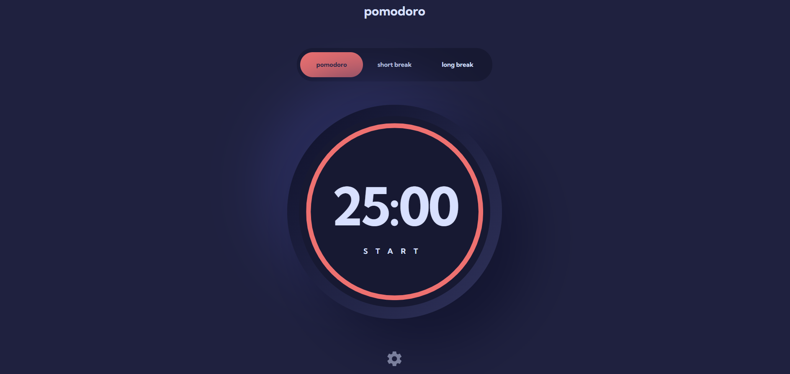

# Frontend Mentor - Pomodoro app solution

This is a solution to the [Pomodoro app challenge on Frontend Mentor](https://www.frontendmentor.io/challenges/pomodoro-app-KBFnycJ6G). Frontend Mentor challenges help you improve your coding skills by building realistic projects.

## Table of contents

- [Overview](#overview)
  - [The challenge](#the-challenge)
  - [Screenshot](#screenshot)
  - [Links](#links)
- [My process](#my-process)
  - [Built with](#built-with)
  - [What I learned](#what-i-learned)
  - [Continued development](#continued-development)
  - [Useful resources](#useful-resources)
- [Author](#author)

## Overview

### The challenge

Users can:

- Set a pomodoro timer and short & long break timers
- Customize how long each timer runs for
- See a circular progress bar that updates every minute and represents how far through their timer they are
- Customize the appearance of the app with the ability to set preferences for colors and fonts

### Screenshot



### Links

// LINKS TO BE ADDED

- Solution URL: [Add solution URL here](https://your-solution-url.com)
- Live Site URL: [Add live site URL here](https://your-live-site-url.com)

## My process

### Built with

- Semantic HTML5 markup
- Flexbox
- CSS Grid
- CSS/SASS
- Mobile-first workflow
- [TailwindCSS](https://tailwindcss.com)
- React Hooks
- [React](https://reactjs.org/) - JS library
- [react-countdown-circle-timer](https://www.npmjs.com/package/react-countdown-circle-timer) - package for creating a countdown circle progress bar

### What I learned

There were a few things I learn't from this project, one was a new behaviour about tailwindcss I didn't know and another about how to build progress bars.

First thing, in tailwind I learned that you can not add dynamicly created classes into the jsx. This is because of the way tailwind works, it will render only the created classes that it recognizes when initialy scanning your code, so dynamicly created classes will not be rendered. Adding classes conditionally though is still ok because these classes are read by tailwind before it reads the code.

Another thing I learned in this projects was a few different ways of creating circle progress bars for the countdown timer.

One way I tried to do it, worked well but was always a little bit out of sync with the time. As I am not familiar with svg animation, this was inspired by a logRocket post about how to do this. This way was to use a custom component with the main parent element inside was a svg and inside that was two circle svg properties to create the circle. Then we added the animations to the stroke of the circle and synced them up with the timer. This way worked to a degree but not only was it a little out of sync but the animation itself was not smooth and very jumpy, so I decided not to go with this solution.

Another solution I tried was Inspired by a youtube video explaining how to do this animation in CSS using the timer seconds to control the transform rotate property in css and match the timer. To do this, it rotated 3 different semi-circles on top of each other, with one rotating for the first 180deg and the second and first one then rotating for the second half up to 360deg and the third one would only apear at this stage to hide the excess semi-circle when they fully came around to the first starting postition. The problem with this solution was, even though the animation worked well, the semi circle hiding the others at the end still didn't prevent a line of the progresses bar colour to come through, and even though the semi-circle had a higher z-index and anything bigger than that would be cut off by the overflow, it still persisted. Another problem was that it was not able to pause the animation mid way, even if we could pause the timer, the progress bar would always reset and cause it to go out of sync.

So In the end I decided to use a npm package called "react-countdown-circle-timer", which allowed me to create a component and easily customize it using different props. This package was built on the concept of the first solution, of using and animating an SVG and syncing it to the timer.

### Here is an example of the progress component

```js
import React, { useEffect, useState } from "react";
import { CountdownCircleTimer } from "react-countdown-circle-timer";

const CircleProgress = ({
  time,
  hasTimerStarted,
  activeTheme,
  setKey,
  keyValue,
}) => {
  const [size, setSize] = useState(248);
  //
  useEffect(() => {
    const medQuery = window.matchMedia("(min-width: 630px)");
    const handleMedQuery = (match) => {
      if (match.matches) {
        setSize(339);
      } else {
        setSize(248);
      }
    };
    medQuery.addEventListener("change", handleMedQuery);
    handleMedQuery(medQuery);
    return () => medQuery.removeEventListener("change", handleMedQuery);
  }, []);
  return (
    <div className="absolute top-1/2 left-1/2 -translate-x-1/2 -translate-y-1/2">
      <CountdownCircleTimer
        key={keyValue}
        className="mx-auto"
        size={size}
        strokeWidth={9}
        isPlaying={hasTimerStarted}
        duration={time.mode[time.activeMode.id - 1].timerMins * 60}
        colors={activeTheme.hex}
        colorsTime={[10, 6, 3, 0]}
        rotation={"counterclockwise"}
        trailColor="none"
      ></CountdownCircleTimer>
    </div>
  );
};

export default CircleProgress;
```

### Here is an example of using condition classes in tailwind & not being able to dynamicly create classes

```html

<!-- Conditionaly -->
✔ `${mode.isActive && `${activeTheme.name} `

{mode.map(mode=> {
        return (
          <button
            key={mode.id}
            className={`${
              mode.isActive && `${activeTheme.name} `
            } `}
            onClick={() => {
              handleChangeMode(mode.id)
            }}
          >
            {mode.mode}
          </button>
        );
      })}

<!-- Creating dynamicly -->

❌ // `bg--${activeTheme.name} `

{mode.map(mode=> {
        return (
          <button
            key={mode.id}
            className={`${
              `bg--${activeTheme.name} `
            } `}
            onClick={() => {
              handleChangeMode(mode.id)
            }}
          >
            {mode.mode}
          </button>
        );
      })}
```


### Continued development

One of the progress bar animation solutions I tried, the one where we created and animated our own SVG. Has inspired me to learn more about how to create and animate SVGs and is something I am very instrested in learning more about, and I look foward to try and use them in some of my projects in the future.

### Useful resources

- [LogRocket blog](https://blog.logrocket.com/build-svg-circular-progress-component-react-hooks) - This is the blog I used to help create a custom SVG animated progess bar.

- [Youtube Video](https://www.youtube.com/watch?v=uHVPAcaW1VQ) - This is the youtube video from a channel called EFtechLab. Which shows how to use CSS & Javascript to create a progress bar.

- [NPM-Package](https://www.npmjs.com/package/react-countdown-circle-timer) - Here is the link to the NPM package documentation I used to create the progress I used in the final version of this project.


## Author

- Website - [David-Henery](https://www.djhwebdevelopment.com)
- Frontend Mentor - [@David-Henery4](https://www.frontendmentor.io/profile/David-Henery4)
- linkedIn - [David Henery](https://www.linkedin.com/in/david-henery-725458241)
